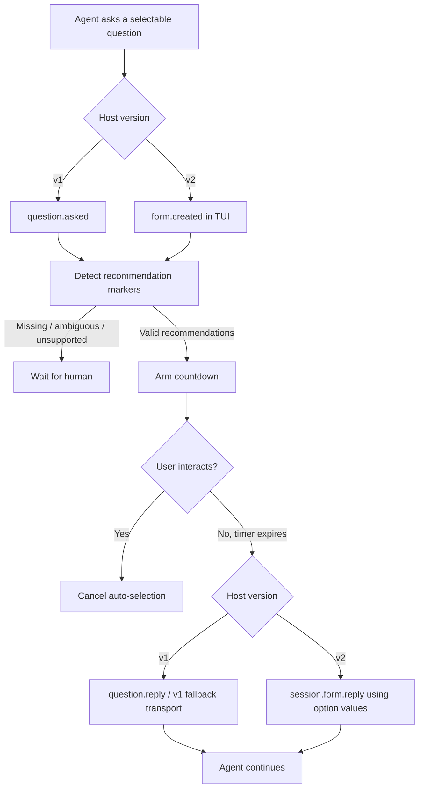

# opencode-smart-questions 💡

[](https://opensource.org/licenses/MIT)
[](https://github.com/huseyincig/opencode-smart-questions)
[](https://www.typescriptlang.org/)
[](tests/)

Language-neutral auto-selection of agent-recommended choices for **OpenCode** question prompts, with a visible countdown and cancellation when the user starts interacting. The option text can be in any language: selection depends on an exact recommendation token, not language recognition.

The package contains separate adapters for **OpenCode v1** and **OpenCode v2** rather than translating one host API into the other. V2 behavior is covered by automated mock-host tests; live V2 host integration is not yet verified.

---

## Features

- **Native recommendation guidance:** v1 enriches `tool.definition` and `experimental.chat.system.transform`; full v2 hosts use `ctx.tool.transform(...)` and `ctx.session.hook("context", ...)`. Transition builds that invoke `setup()` without the complete v2 capability surface are detected and ignored safely.
- **Version-native question handling:** v1 consumes `question.asked/replied/rejected`; v2 consumes `form.created/replied/cancelled` in the TUI and replies through `session.form.reply(...)`.
- **Single- and multi-select support:** recommended single choices and multiple recommended checkbox choices are both supported.
- **Human interaction guard:** keyboard or paste interaction cancels pending auto-selection. V2 rechecks the current pending form after asynchronous synchronization and immediately before sending its reply. Already-issued replies cannot be recalled. The plugin never injects fake key presses into stdin.
- **Conservative matching:** no auto-answer is sent when a field has no recommendation, a single-select field is ambiguous, a v2 form contains unsupported free-text/number/boolean/external fields, or recommended labels cannot be mapped unambiguously to form values.
- **Language-neutral recommendations:** the default token is `[SQ:recommended]`, independent of the language used in option text. Legacy `(Recommended)` and `(Önerilen)` markers remain accepted; custom suffix markers are supported. Labels are compared using Unicode NFC normalization and trailing-whitespace tolerance.
- **Safe draft lock paths:** request IDs are encoded before being used in lock filenames.
- **OpenTUI integration:** a countdown panel shows the choices that will be selected and switches to `AUTO-SELECTION DISABLED` when the user takes control.
- **Pre-built distribution:** compiled ESM, declarations, and adaptive TUI bundles are included. OpenTUI/Solid are peer runtimes rather than bundled duplicate renderer instances.
- **No configuration file required:** defaults are used when `smart-question.json` is absent. A malformed config disables auto-selection rather than guessing.
- **Visible failure:** if a v2 automatic reply fails, the TUI displays a manual-answer warning and logs an error.

---

## Installation

### OpenCode v1

Add the package to the server/runtime plugin list:

```json
{
  "plugin": [
    "opencode-smart-questions@latest"
  ]
}
```

For the v1 countdown UI, also add the package to the v1 TUI plugin config:

```json
{
  "$schema": "https://opencode.ai/tui.json",
  "plugin": [
    "opencode-smart-questions@latest"
  ]
}
```

The package exposes separate `./server` and `./tui` entries so v1 can load each target independently.

### OpenCode v2

Use the v2 `plugins` key:

```json
{
  "plugins": [
    "opencode-smart-questions@latest"
  ]
}
```

OpenCode v2 loads the server plugin and automatically discovers the package's `./tui` export for the terminal client. No duplicate `tui.json` registration is needed for the package.

### Local development

```bash
git clone https://github.com/huseyincig/opencode-smart-questions.git ~/.config/opencode/vendor/opencode-smart-questions
```

v1 server example:

```json
{
  "plugin": [
    "file:///home/me/.config/opencode/vendor/opencode-smart-questions"
  ]
}
```

v2 example:

```json
{
  "plugins": [
    "file:///home/me/.config/opencode/vendor/opencode-smart-questions"
  ]
}
```

For v1 TUI loading, use the same `file:///...` package path in the v1 `tui.json` plugin list.

---

## Configuration

Configuration is discovered in this order:

1. `<project-root>/.opencode/smart-question.json`
2. `<project-root>/smart-question.json`
3. `~/.config/opencode/smart-question.json`
4. built-in defaults when no file exists

Example:

```json
{
  "enabled": true,
  "timeoutMs": 30000,
  "recommendedMarkers": [
    "[SQ:recommended]",
    "(Recommended)",
    "(Önerilen)"
  ],
  "requireExactlyOneRecommendation": true,
  "uiText": {
    "recommendation": "Öneri:",
    "disabled": "OTOMATİK SEÇİM DEVRE DIŞI",
    "autoReplyFailed": "Otomatik yanıt başarısız. Lütfen elle yanıtlayın.",
    "agent": "Ajan:",
    "session": "Oturum:"
  },
  "debugLog": ""
}
```

| Option | Type | Default | Description |
| :--- | :--- | :--- | :--- |
| `enabled` | `boolean` | `true` | Enables or disables the plugin. |
| `timeoutMs` | `number` | `30000` | Delay before a recommended answer is sent. |
| `recommendedMarkers` | `string[]` | `["[SQ:recommended]", "(Recommended)", "(Önerilen)"]` | Exact language-neutral and legacy recommendation suffixes. |
| `recommendedMarker` | `string` | `[SQ:recommended]` | Legacy single-marker configuration form. |
| `requireExactlyOneRecommendation` | `boolean` | `true` | Requires exactly one recommendation for single-select questions. Multi-select may contain multiple recommendations. |
| `uiText` | `object` | English UI labels | Optional translatable TUI labels: `recommendation`, `disabled`, `autoReplyFailed`, `agent`, `session`. Supply strings in any language. |
| `debugLog` | `string` | `""` | Optional file path for diagnostic logging. No debug file is written when empty. |

---

## Language-independent behavior

The recommendation token is a protocol marker, **not a translated word**. The agent writes questions and options in the user's language, then appends the exact `[SQ:recommended]` token to recommended option labels. For example, `保存 [SQ:recommended]`, `حفظ [SQ:recommended]`, and `Guardar [SQ:recommended]` follow the same matching logic. Existing English/Turkish marker labels continue to work. Custom markers may be configured for other conventions; the detector does not try to translate arbitrary natural-language recommendations. The `uiText` configuration localizes TUI messages independently of the recommendation token.

**Auto-selection does not judge whether the agent's recommendation is correct or authorized.** The guidance instructs the agent not to mark choices requiring human approval, such as destructive or irreversible actions. This is prompt guidance, not a guaranteed safety barrier: use OpenCode's permission and confirmation mechanisms for sensitive operations. `timeoutMs: 0` leaves no user-intervention window; use a positive timeout when cancellation matters.

## How it works



### v1

The backend listens for `question.*` events and owns the reply timer. The TUI displays the countdown and writes a draft lock when the user interacts. Reply transport prefers the native question client, then the v1 internal client, then the v1 REST endpoint when necessary.

### v2

The backend injects recommendation guidance using native v2 transforms. The terminal plugin observes `form.created`, maps recommended option labels back to their stable form `value` fields, and owns the countdown/reply because v2 server plugin context does not expose the form reply API. Before replying, it refreshes pending forms and verifies that the request was not cancelled or replaced. If the reply fails, the TUI asks for a manual answer.

Global/MCP forms and forms containing unsupported non-choice fields are not auto-answered.

---

## Testing

```bash
# Build and run unit/regression tests
npm test

# Typecheck sources
npm run typecheck

# Build server and TUI distribution
npm run build

# Isolated v1 smoke + scenario tests
node sandbox/smoke-test.mjs
node sandbox/comprehensive-test.mjs

# Verify publish contents
npm pack --dry-run
```

The regression suite includes v1 timer/cancellation behavior, language-neutral and legacy markers, draft-lock handling, v2 form label→value mapping, duplicate-label refusal, v2 backend transforms, v2 TUI auto-reply, partial-v2 capability detection, cancellation during synchronization, user-input cancellation, and path traversal protection. The TUI source is typechecked. The tests use simulated hosts; a real v2 OpenCode end-to-end run remains outstanding.

---

## Project structure

```
opencode-smart-questions/
├── dist/                    # Compiled server + adaptive TUI bundles
├── src/
│   ├── index.ts             # v1 server + v2 backend entry
│   ├── backend.ts           # v1 question lifecycle/reply routing
│   ├── config.ts            # Config discovery and normalization
│   ├── detector.ts          # Shared recommendation decision engine
│   ├── draft-guard.ts       # Human draft lock management
│   ├── form-adapter.ts      # v2 form -> question/value mapping
│   ├── guidance.ts          # Shared prompt/tool guidance
│   ├── types.ts
│   └── ui.tsx               # v1 and v2 TUI adapters
├── scripts/
│   └── emit-tui.mjs         # Host-runtime + standalone TUI bundler
├── sandbox/
├── tests/
│   └── smart-question.test.mjs
├── index.js
├── server.js
├── tui.js
├── package.json
└── tsconfig.json
```

---

## License

[MIT](LICENSE) © Hüseyin Hadi Çığ
