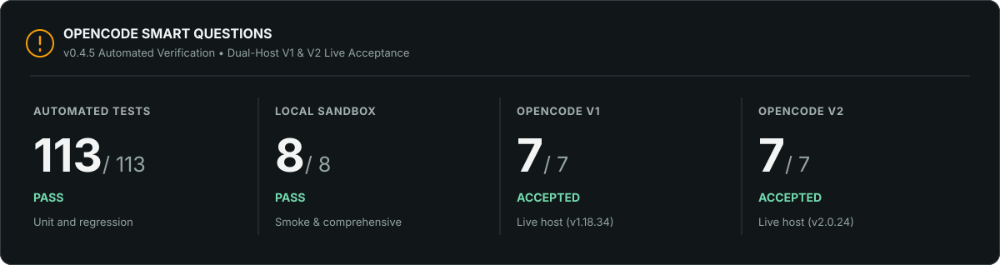
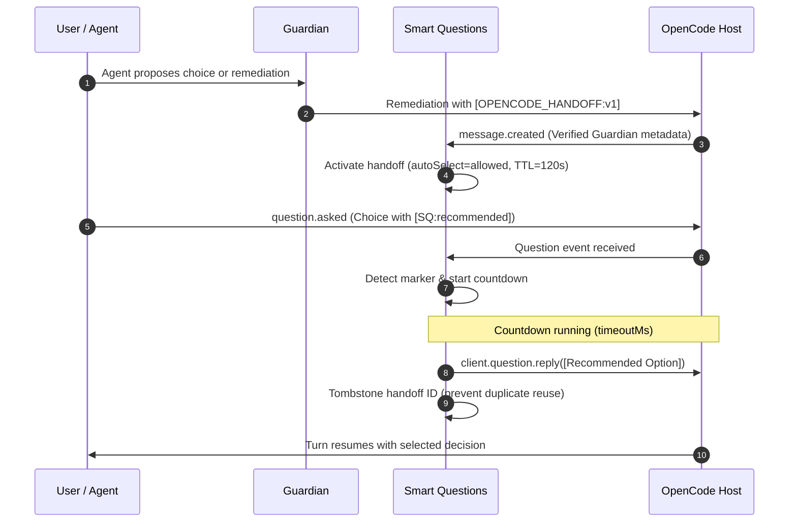

# 💡 OpenCode Smart Questions

[](https://www.npmjs.com/package/opencode-smart-questions)
[](https://www.npmjs.com/package/opencode-smart-questions)
[](https://opencode.ai)
[](docs/acceptance-v1.md)
[](docs/verification.md)
[](package.json)
[](tsconfig.json)
[](LICENSE)

[Installation](#-installation) · [How Selection Works](#-how-selection-works) · [Coordination Handoff](#-guardian--smart-questions-coordination) · [Architecture & Flowchart](#-architecture--selection-lifecycle) · [Configuration](#-configuration) · [Validation](#-validation--testing)

A high-performance, deterministic OpenCode plugin that selects an agent-recommended answer after a configurable countdown, unless the user intervenes. It supports single-choice and multiple-choice questions with decoupled, versioned OpenCode V1 and V2 host adapters.

**Language-independent selection:** Question text and options can be written in any language. The plugin recognizes exact configured markers such as `[SQ:recommended]`; it does not translate or alter recommendations. The alternative `(Recommended)` and `(Önerilen)` markers are also accepted by default.

---

## 📊 Verification & Live Acceptance



> The graphic displays the current **v0.4.5 automated verification** along with real host acceptance on **OpenCode V1 (`1.18.34`)** and **OpenCode V2 (`2.0.24`)** executed with the mandatory test model `opencode-go/mimo-v2.6-flash`.

Smart Questions **v0.4.5** is validated as follows:

- **Current Automated Verification:** **113 / 113** unit and regression tests passing.
- **Sandbox Scenarios:** **8 / 8** isolated smoke and comprehensive test suites passing.
- **Static Analysis:** Standard and strict TypeScript gates pass; Oxlint reports **0 warnings / 0 errors**.
- **Dependency Security:** **0 vulnerabilities** across production and development dependency audits.
- **Real Host Acceptance (V1 & V2):** Both OpenCode V1 (`1.18.34`) and OpenCode V2 (`2.0.24`) verified with real LLM agent sessions (`opencode-go/mimo-v2.6-flash`).

Read the detailed [V1 Acceptance Report](docs/acceptance-v1.md), [V2 Acceptance Report](docs/acceptance-v2.md), and [Technical Verification](docs/verification.md) for full reproduction steps and test harnesses.

---

## ✨ Key Highlights

- **Dual-Mode Architecture:** Seamlessly supports both **OpenCode v1** (`@opencode-ai/plugin`) and **OpenCode v2** (`@opencode/plugin`) with unified runtime adapters.
- **Language-Independent Selection:** Suffix matching works identically across all natural languages (`Kaydet [SQ:recommended]`, `Save [SQ:recommended]`, `保存 [SQ:recommended]`) with Unicode NFC normalization.
- **Fail-Safe Ambiguity Gates:** Automatically aborts auto-selection when a single-select question contains multiple recommendations, or zero recommendations are present.
- **User Intervention & Draft-Guard:** Cancels auto-reply immediately upon user typing, keyboard entry, draft file locking, or manual form response.
- **Decoupled Guardian Handoff (`[OPENCODE_HANDOFF:v1]`):** Integrates seamlessly with OpenCode Guardian without npm dependencies. Strictly blocks auto-reply when Guardian designates `auto_select=forbidden` for destructive/approval actions.
- **Anti-Spoofing & Replay Protection:** Rejects untrusted handoff blocks lacking Guardian provenance, invalidates stale handoffs after 120s TTL, and tombstones consumed IDs against replay attacks.
- **Main Agent Scope Enforcement:** Excludes child/subagent sessions from auto-reply, preventing recursive subagent interference.
- **Zero Runtime Dependencies:** Pure TypeScript precompiled to `dist/` with no heavy third-party runtime dependencies.

---

## 📦 Installation

The current source version is **0.4.5**.

### 🟢 OpenCode V1 (1.x)

Add the package to the server plugin configuration in your `opencode.json` (`~/.config/opencode/opencode.json` or project-local):

```json
{
  "plugin": ["opencode-smart-questions@latest"]
}
```

To display the countdown panel in the terminal UI, also register the package in the V1 terminal configuration (`tui.json`):

```json
{
  "$schema": "https://opencode.ai/tui.json",
  "plugin": ["opencode-smart-questions@latest"]
}
```

### 🔵 OpenCode V2 (2.x)

Use the V2 **`plugins`** array in `opencode.json` or `opencode.jsonc`:

```json
{
  "plugins": ["opencode-smart-questions@latest"]
}
```

On V2 builds, the `./tui` export provides reactive countdown and form-reply handling.

### 🛠️ Local Development

Clone the repository into your OpenCode plugins or vendor directory:

```bash
git clone https://github.com/huseyincig/opencode-smart-questions.git ~/.config/opencode/vendor/opencode-smart-questions
```

Use the `file:///` URL in `opencode.json`:

```json
{
  "plugin": ["file:///path/to/opencode-smart-questions"]
}
```

---

## ⚡ How Selection Works

1. The agent marks each recommended option by appending `[SQ:recommended]` to its label.
2. The V1 backend intercepts `question.asked`; the V2 TUI intercepts `form.created`. Both execute the shared recommendation detector.
3. Only questions with unambiguous recommendations are eligible. Single-select questions must contain exactly one recommended option.
4. A countdown timer begins (`30000 ms` default). Any keyboard typing or manual selection cancels the pending countdown immediately.
5. If the request remains eligible upon expiry, V1 issues `client.question.reply`; V2 validates the pending form and submits `session.form.reply`.

> [!IMPORTANT]
> **Selection is not permission.** The plugin cannot determine whether a recommendation is correct, safe, or authorized. Destructive, irreversible, or privileged operations must require human approval. When paired with OpenCode Guardian, destructive actions are marked `auto_select=forbidden`, which strictly disables auto-selection.

---

## 🤝 Guardian + Smart Questions Coordination

OpenCode Guardian and Smart Questions coordinate through a decoupled, versioned handoff protocol without importing each other as package dependencies:

```text
[OPENCODE_HANDOFF:v1]
source=guardian
action=question_required
kind=choice
auto_select=allowed
handoff_id=gq_c47f9a12b0
```

### Security & Coordination Matrix:

| Guardian Classification | Handoff Directive | Smart Questions Action |
| :--- | :--- | :--- |
| **Clarification / Choice** | `kind=choice`<br>`auto_select=allowed` | Validates recommendation, schedules countdown, auto-selects if uninterrupted. |
| **Destructive / Irreversible** | `kind=approval`<br>`auto_select=forbidden` | Displays choices but **strictly blocks** countdown and auto-selection. Manual user approval required. |
| **Untrusted / Spoofed Text** | Missing Guardian metadata | **Rejected** by anti-spoof extractor (`null`). No handoff activated. |
| **Stale / Prior Turn** | Exceeded 120s TTL or new user turn | **Purged & tombstoned**. Cannot be resurrected via message history. |

---

## 🔄 Architecture & Selection Lifecycle

### 1. Decision Flowchart

```mermaid
flowchart TD
    Event[Question / Form event received] --> Scope{Root session?}
    Scope -->|Child / Subagent| Ignore[Ignore event; no timer started]
    Scope -->|Root session| HandoffCheck{Active Guardian handoff?}

    HandoffCheck -->|auto_select=forbidden| BlockAuto[Suppress countdown; require manual user answer]
    HandoffCheck -->|None or auto_select=allowed| Detect[Detect recommendation markers]

    Detect --> DetectCheck{Detection status?}
    DetectCheck -->|Zero recommendations| Fallback[Fail-safe: leave to user]
    DetectCheck -->|Multiple in single-select| Fallback
    DetectCheck -->|Exactly one recommendation| DraftCheck{User draft lock active?}

    DraftCheck -->|Lock present / composing| Fallback
    DraftCheck -->|Lock free| Schedule[Schedule countdown timer (timeoutMs)]

    Schedule --> Intervene{User intervention before timeout?}
    Intervene -->|Manual click / keypress| Cancel[Cancel timer and clear handoff]
    Intervene -->|Timeout expires cleanly| Recheck{Still valid & unlocked?}

    Recheck -->|No| Cancel
    Recheck -->|Yes| Dispatch[Execute question / form reply transport]
    Dispatch --> Consume[Tombstone handoff ID against replay]
    Consume --> Complete[Agent resumes execution with selected answer]
```

### 2. Coordination Sequence Diagram



---

## ⚙️ Configuration (`smart-question.json`)

Settings are resolved hierarchically from `<project>/.opencode/smart-question.json`, `<project>/smart-question.json`, or `~/.config/opencode/smart-question.json`:

```json
{
  "enabled": true,
  "timeoutMs": 30000,
  "recommendedMarkers": [
    "[SQ:recommended]",
    "(Recommended)",
    "(Önerilen)"
  ],
  "requireExactlyOneRecommendation": true,
  "uiText": {
    "recommendation": "Recommendation:",
    "disabled": "AUTO-SELECTION DISABLED",
    "autoReplyFailed": "Auto-reply failed. Please select manually.",
    "agent": "Agent:",
    "session": "Session:"
  },
  "debugLog": ""
}
```

### 🎛️ Configuration Options:

| Setting | Default | Description |
| :--- | :---: | :--- |
| `enabled` | `true` | Enables or disables the plugin. |
| `timeoutMs` | `30000` | Countdown duration in milliseconds before auto-selecting. |
| `recommendedMarkers` | `["[SQ:recommended]", ...]` | Accepted suffix markers indicating an agent recommendation. |
| `requireExactlyOneRecommendation` | `true` | Enforces unambiguous recommendation matching for single-choice questions. |
| `uiText` | English labels | Localized TUI text strings for labels and warning notices. |
| `debugLog` | `""` | File path for append-only diagnostic logging (`0600` permissions). |

---

## 🧪 Validation & Testing

Run the full verification suite locally:

```bash
npm ci
npm run typecheck
npm test
node sandbox/smoke-test.mjs
node sandbox/comprehensive-test.mjs
npm run lint
npm audit
npm pack --dry-run
```

- **CI Matrix:** Runs on Node 22 and Node 24 with strict typechecking and Oxlint verification.
- **Acceptance Reports:** See [V1 Acceptance](docs/acceptance-v1.md) and [V2 Acceptance](docs/acceptance-v2.md) for live host benchmarks.
- **Technical Specifications:** Detailed boundaries and limitations are documented in [Technical Verification](docs/verification.md).

---

## 🏗️ Project Layout

- `src/backend.ts`: V1 event hooks, question auto-reply dispatch, and handoff coordination.
- `src/ui.tsx`: V1 and V2 interactive TUI countdown panel with reactive Solid state.
- `src/detector.ts`: Pure recommendation parser enforcing single/multi-choice invariants.
- `src/handoff.ts`: `[OPENCODE_HANDOFF:v1]` protocol parser, provenance checks, and TTL/replay tracking.
- `src/form-adapter.ts`: OpenCode V2 form schema adapter and field value mapper.
- `src/draft-guard.ts`: POSIX file-based draft locks preventing auto-reply during user typing.
- `src/config.ts`: Configuration resolver and JSON schema validator.
- `src/session-scope.ts`: V1/V2 session hierarchy analyzer ensuring root-agent isolation.
- `src/index.ts`: Dual-mode plugin entrypoint exporting V1 and V2 plugin definitions.

---

## 📄 License

MIT © [Hüseyin Hadi Çığ](https://github.com/huseyincig)
