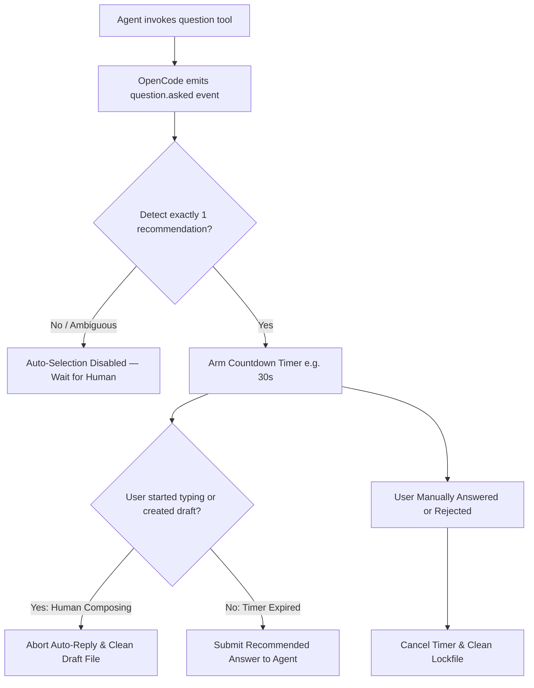

# opencode-smart-questions 💡

[](https://opensource.org/licenses/MIT)
[](https://github.com/huseyincig/opencode-smart-questions)
[](https://www.typescriptlang.org/)
[](tests/)

Intelligent auto-selection of recommended options for **OpenCode** AI agent question prompts with safe human-draft detection and terminal UI countdown.

Dual-Mode compatible: works seamlessly out of the box with both **OpenCode 1.x** and **OpenCode 2.x**.

---

## 🌟 Features

- **Unattended Auto-Selection:** Automatically selects recommended choices after a configurable countdown (default: 30s) when an agent asks a question.
- **Safe Human-Draft Detection:** If the human operator focuses the input or starts typing a custom answer, auto-selection is immediately aborted. Human input is never overwritten.
- **Fail-Safe Decision Engine:** Auto-selection only triggers when **exactly one** option has an accepted recommendation marker. If 0 or 2+ options match, auto-selection safely disables itself.
- **Multi-Language Support:** Defaults to `["(Recommended)", "(Önerilen)"]` and is easily extensible for any language or custom marker suffix.
- **Multi-Path Transport:** Robust multi-tier fallback architecture:
  1. Native v2 SDK: `client.question.reply(...)`
  2. Internal v1 client: `client._client.post(...)`
  3. Direct REST endpoint: `POST /question/{id}/reply` via `serverUrl`
- **Pre-Built Distribution:** Pre-compiled ESM distribution (`dist/`) is tracked in git for zero-build, zero-dependency instant installation.
- **OpenTUI / Terminal UI Integration:** Includes terminal countdown indicator and recommended choice badges (`★ ÖNERİLEN` / `RECOMMENDED`).

---

## 📦 Installation

You do **not** need an npm registry release to install and use this plugin right now. Choose any of the methods below:

### Method 1: Directly from GitHub (Recommended)

Add to your OpenCode configuration (`~/.config/opencode/opencode.json` or project-local `opencode.json`):

```json
{
  "plugin": [
    "github:huseyincig/opencode-smart-questions"
  ]
}
```

Or install it via `npm` / `bun`:

```bash
npm install github:huseyincig/opencode-smart-questions
```

### Method 2: Local Directory / Development

If developing or testing locally on your system:

```json
{
  "plugin": [
    "file:/opt/nc-workspace/opencode-smart-questions"
  ]
}
```

### Method 3: Git Clone

```bash
git clone https://github.com/huseyincig/opencode-smart-questions.git
```
Pre-compiled distribution files are ready in `dist/`, so no `build` step is required before usage.

### Registering the terminal countdown panel (`tui.json`)

The steps above install the **backend** (auto-selection after the countdown).
The **countdown overlay itself** lives in a *second* OpenCode registry, read by
the TUI process at startup, so add the same package name there too:

```json
{
  "$schema": "https://opencode.ai/tui.json",
  "plugin": [
    "github:huseyincig/opencode-smart-questions"
  ]
}
```

- **Same specifier as `opencode.json`** — OpenCode resolves `exports["./tui"]` (pre-compiled Solid Universal `dist/tui.js`) from it.
- `dist/tui.js` is compiled with Solid Universal (`babel-preset-solid` with `{ moduleName: "@opentui/solid", generate: "universal" }`), so it integrates natively with OpenTUI's reactive rendering engine without any external runtime dependencies.
- **Skip this step** if you only want auto-selection and no countdown — the
  backend works without it.
- `tui.json` is read only at OpenCode startup; restart after editing.

Without this entry the plugin still auto-selects, but the `00:30` countdown,
the `★ ÖNERİLEN` badge and the `AUTO-SELECTION DISABLED` state never render.

---

## ⚙️ Configuration (`smart-question.json`)

Configuration is auto-discovered in the following priority order:
1. `<project-root>/.opencode/smart-question.json`
2. `<project-root>/smart-question.json`
3. `~/.config/opencode/smart-question.json`

Example `smart-question.json`:

```json
{
  "enabled": true,
  "timeoutMs": 30000,
  "recommendedMarkers": [
    "(Recommended)",
    "(Önerilen)"
  ],
  "requireExactlyOneRecommendation": true,
  "debugLog": "/tmp/smart-question.log"
}
```

### Configuration Options:

| Option | Type | Default | Description |
| :--- | :--- | :--- | :--- |
| `enabled` | `boolean` | `true` | Master switch to enable or disable the plugin. |
| `timeoutMs` | `number` | `30000` | Countdown duration in milliseconds before auto-replying. |
| `recommendedMarkers` | `string[]` | `["(Recommended)", "(Önerilen)"]` | Accepted suffix markers for recommended options. |
| `requireExactlyOneRecommendation` | `boolean` | `true` | Fail-safe requiring exactly one recommended option per question. |
| `debugLog` | `string` | `""` | Optional file path for audit logs (avoids cluttering TUI stderr). |

---

## 🔄 How It Works: Lifecycle & Human-Draft Guard



1. **Detection:** When `question.asked` arrives, the detector inspects option labels. If exactly one option ends with an accepted marker (e.g. `Blue-Green (Recommended)`), a timer is armed.
2. **Draft Detection:** In TUI mode or when a draft file (`.opencode/.sq-draft-<requestID>`) is created (human starts typing), auto-reply is aborted immediately.
3. **Cancellation:** If the user selects any option manually or rejects the prompt before the timer fires, the pending timer is cancelled immediately.

---

## 🧪 Testing & Verification

The project includes unit tests and an isolated sandbox simulation suite:

```bash
# Run 39/39 unit tests (~950ms)
npm test

# Run isolated sandbox end-to-end suite (10 scenarios)
node sandbox/comprehensive-test.mjs

# Run sandbox smoke test
node sandbox/smoke-test.mjs
```

---

## 🛠️ Project Structure

```
opencode-smart-questions/
├── dist/                # Pre-compiled ESM distribution files (tracked for zero-build installs)
├── src/
│   ├── index.ts         # Dual-Mode entry point (OpenCode v1 server & v2 setup)
│   ├── types.ts         # TypeScript interfaces & types
│   ├── config.ts        # Configuration discovery & marker normalization
│   ├── detector.ts      # Pure recommendation detection engine
│   ├── draft-guard.ts   # Human draft detection & lockfile management
│   ├── backend.ts       # Event handlers & multi-path reply routing
│   └── ui.tsx           # Solid / OpenTUI presentation component
├── sandbox/             # Isolated sandbox scenario tests
│   ├── comprehensive-test.mjs
│   └── smoke-test.mjs
├── tests/
│   └── smart-question.test.mjs   # 39 Unit test cases
├── package.json
├── tsconfig.json
├── LICENSE              # MIT License
└── README.md
```

---

## 📄 License

[MIT](LICENSE) © Hüseyin Hadi Çığ
