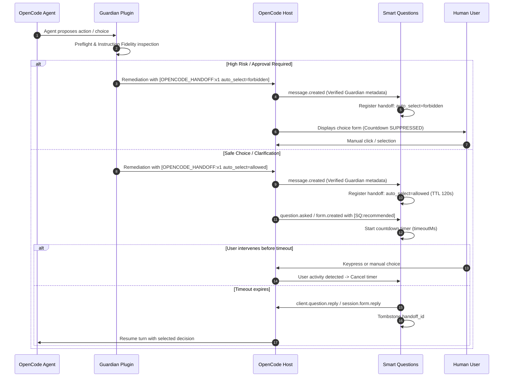

# Guardian + Smart Questions Coordination Protocol

OpenCode Guardian and Smart Questions are **completely standalone, independent plugins** with zero package dependencies on each other.

When installed together within the same OpenCode workspace or global environment, they optionally coordinate through a decoupled, versioned event handoff protocol (`[OPENCODE_HANDOFF:v1]`).

---

## 🔒 Why Coordinate?

| Standalone Smart Questions | Coordinated with Guardian |
| :--- | :--- |
| Answers recommended questions after a timeout unless the user intervenes. | Honors Guardian's safety classification. If Guardian flags an action as destructive (`auto_select=forbidden`), Smart Questions locks the UI to manual input only. |
| Cannot know if a question asks for destructive file deletions or harmless architectural preferences. | Guardian's deterministic preflight rules intercept risky operations and enforce human-in-the-loop approvals. |

---

## 📡 The Handoff Contract (`[OPENCODE_HANDOFF:v1]`)

When Guardian determines that an agent requires a genuine user decision, it appends a structured handoff block to its internal remediation turn:

```text
[OPENCODE_HANDOFF:v1]
source=guardian
action=question_required
kind=choice
auto_select=allowed
handoff_id=gq_c47f9a12b0
```

### Security & Lifecycle Invariants

1. **Anti-Spoofing:** Handshakes must originate from verifiable Guardian runtime events. Raw text typed by a user or generated by an untrusted agent model is rejected by the provenance extractor.
2. **Strict Approval Guard (`auto_select=forbidden`):** If an operation requires explicit human approval (destructive file changes, shell risks, secrets, force pushes), Guardian marks `auto_select=forbidden`. Smart Questions immediately suppresses all countdown timers and requires manual user selection.
3. **Turn-Bound 120s TTL:** Handoffs remain valid for a maximum of 120 seconds or until the start of a new user turn. Expired handoffs are automatically purged.
4. **Replay Protection:** Once a handoff ID is consumed by a dispatched question reply, it is permanently tombstoned for the session. Stale handoff IDs cannot be resurrected from chat history.
5. **Main Agent Scope Enforcement:** Subagents and background tasks do not participate in interactive handoff coordination.

---

## 🔄 Coordination Flowchart

```mermaid
flowchart TD
    Agent[Agent requests user decision] --> GCheck{Guardian active?}
    GCheck -->|No / Standalone| Native[Smart Questions standalone flow]
    GCheck -->|Yes| GRules{Guardian evaluates rules}

    GRules -->|Destructive / High Risk| GHandoffForbidden[Generate handoff: auto_select=forbidden]
    GRules -->|Clarification / Choice| GHandoffAllowed[Generate handoff: auto_select=allowed]

    GHandoffForbidden --> SQReceive[Smart Questions receives handoff]
    GHandoffAllowed --> SQReceive

    SQReceive --> SQCheck{auto_select policy}
    SQCheck -->|forbidden| LockManual[Lock UI: Manual user approval required]
    SQCheck -->|allowed| StartCountdown[Start countdown for recommended option]

    StartCountdown --> UserAction{User intervenes?}
    UserAction -->|Yes| CancelTimer[Cancel timer; accept user input]
    UserAction -->|No (timeout)| AutoSelect[Auto-select recommended option]
```

---

## 📊 Coordination Sequence Diagram


